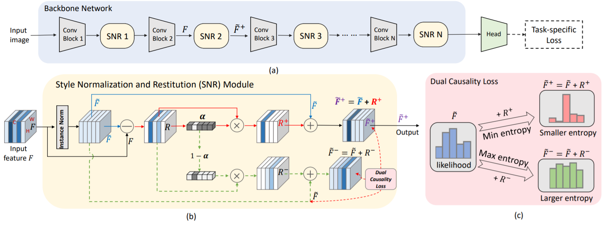

# Style Normalization and Restitution for Domain Generalization and Adaptation

## Introduction

For many practical computer vision applications, the learned models usually have high performance on the datasets used for training but suffer from significant performance degradation when deployed in new environments, where there are usually style differences between the training images and the testing images. An effective domain generalizable model is expected to be able to learn feature representations that are both generalizable and discriminative. 

## Flowchart
In this work, we design a novel Style Normalization and Restitution module (SNR) to simultaneously ensure both high generalization and discrimination capability of the networks.  Figure 1 shows the overall flowchart. In the SNR module, particularly, we filter out the style variations (e.g, illumination, color contrast) by performing Instance Normalization (IN) to obtain style normalized features, where the discrepancy among different samples and domains is reduced. However, such a process is task-ignorant and inevitably removes some task-relevant discriminative information, which could hurt the performance. To remedy this, we propose to distill task-relevant discriminative features from the residual (i.e, the difference between the original feature and the style normalized feature) and add them back to the network to ensure high discrimination. Moreover, for better disentanglement, we enforce a dual causality loss constraint in the restitution step to encourage the better separation of task-relevant and task-irrelevant features. 

<p align="center">
  
</p>
Figure 1: Overall flowchart. (a) Our generalizable feature learning network with the proposed Style Normalization and Restitution (SNR) module being plugged in after some convolutional blocks. Here, we use ResNet-50 as our backbone for illustration. (b) Proposed SNR module. Instance Normalization (IN) is used to eliminate some style discrepancies followed by identity-relevant feature restitution (marked by red solid arrows). Note the branch with dashed green line is only used for enforcing loss constraint and is discarded in inference. (c) Dual causality loss constraint encourages the disentanglement of a residual feature R to task-relevant one and task-irrelevant one, which decreases and enhances, respectively, the entropy by adding them to the style normalized feature.

## Application and Usage

The SNR module is generic and can be applied on different computer vision tasks, including classification, semantic segmentation, and object detection, for enhancing the performance of both domain generalization and unsupervised domain adaptation. 

Please refer to the sub-folder of this repo for each task (classification, object detection, segmentation) and our paper [**Style Normalization and Restitution for Domain Generalization and Adaptation**](https://arxiv.org/pdf/2101.00588.pdf) for more details.


### Reference
If you feel the paper useful or consider using the code, please cite the paper:

```
@article{jin2021style,
  title={Style Normalization and Restitution for Domain Generalization and Adaptation},
  author={Jin, Xin and Lan, Cuiling and Zeng, Wenjun and Chen, Zhibo},
  journal={arXiv preprint arXiv:2101.00588},
  year={2021}
}
```
